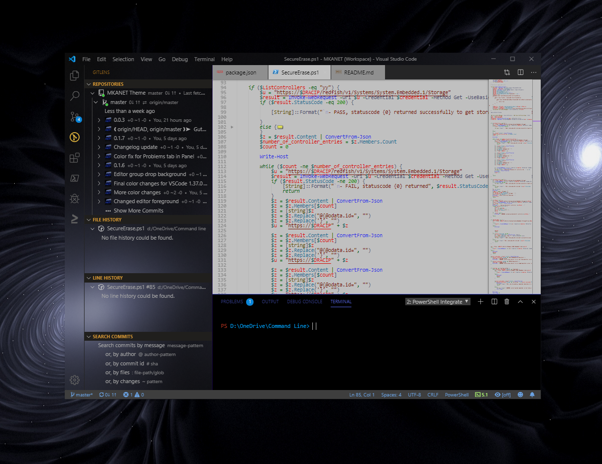
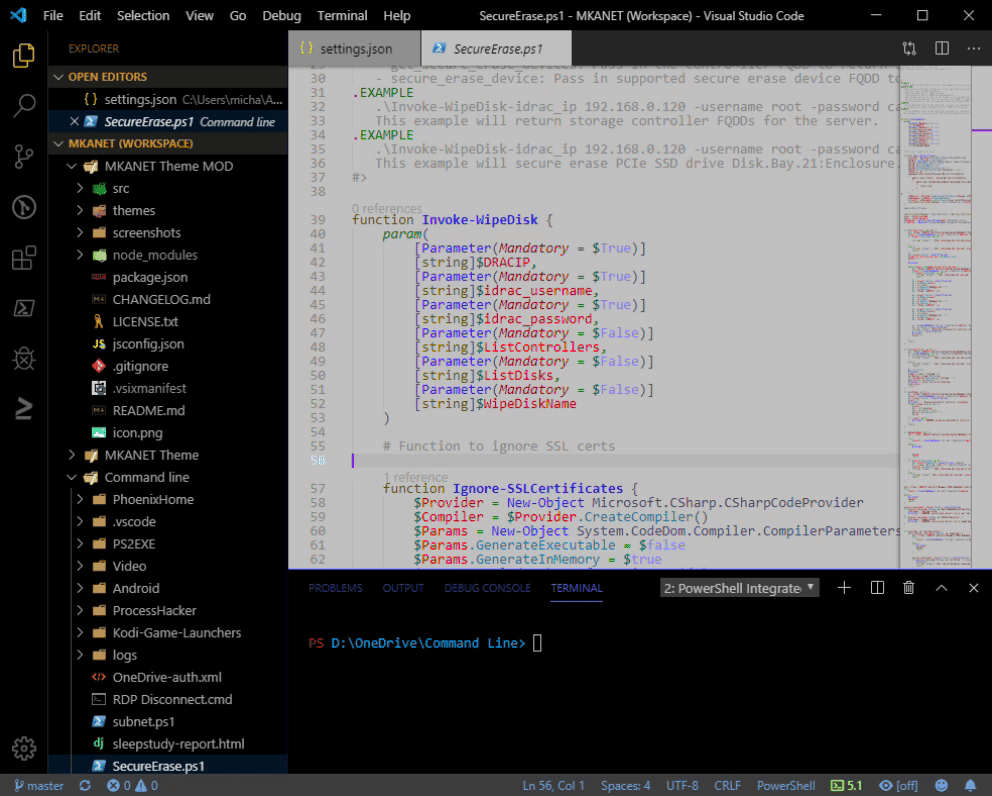

# MKANET V2 color theme for Visual Studio Code

I decided to create my own gray color theme from scratch to avoid headaches I got from traditional dark and light-colored themes.  I spent a lot of time choosing precise colors for syntax coloring and the Sidebar colors and other UI components.

Please note, I added experimental vibrancy support to the sidebar.  I also added custom code folding icons from Sublime Text 3 since the default VSCode folding icons aren't noticeable enough in my opinion.  Hence, this extension is only a "preview" version.

## The ultimate gray color theme with Vibrancy effect & custom code folding icons

**Custom code folding icons:**

**Designer:** Michael K. Avanessian

***Special Thanks to:** "eyhn" from: https://github.com/EYHN/vscode-vibrancy for Vibrancy support!*
