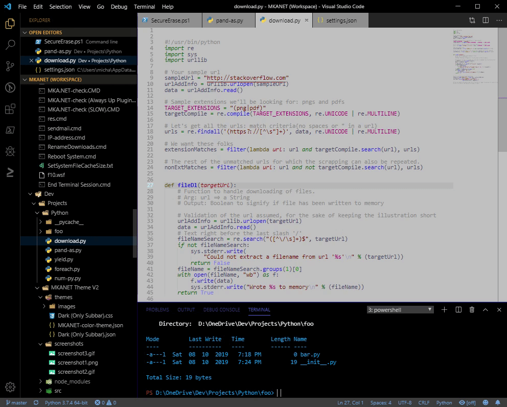

# **MKANET V2 - The ultimate gray color theme**

I decided to create my own gray color theme from scratch to avoid headaches I got from traditional dark and light-colored themes.  I spent a lot of time choosing precise colors for syntax coloring and the Sidebar colors and customizing UI components.

Below, are the bonus features included with this theme:
 
 

## **Vibrancy sidebar:**
 

 
 

## **Custom code folding icons:** 

 
 

## **Custom tab close icons:**

 

**Designer:** Michael K. Avanessian

***Special Thanks:** "eyhn" from https://github.com/EYHN/vscode-vibrancy (for Vibrancy and custom CSS support)*